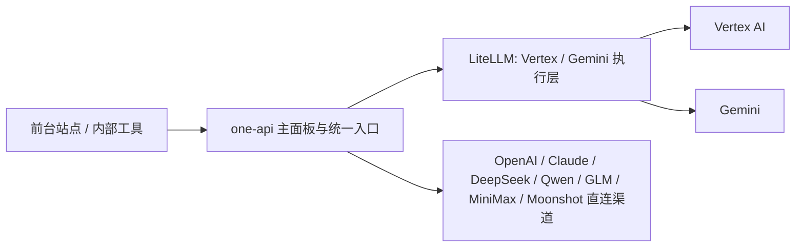

# AI Gateway 方案汇总与拍板结论

## 一句话结论

| 问题 | 结论 |
| --- | --- |
| 主面板选谁 | `one-api` |
| `Vertex / Gemini` 执行层选谁 | `LiteLLM` |
| 最终结构 | `one-api` 做统一入口，`LiteLLM` 只承接 `Vertex / Gemini` |

```text
one-api = 控制层
LiteLLM = Vertex / Gemini 执行层
```

## 为什么这么定

| 方案 | 结论 | 原因 |
| --- | --- | --- |
| `new-api` 做主方案 | 不选 | 功能强，但这轮对 `Vertex` 这条硬链路的把握不如 `one-api + LiteLLM` 稳 |
| `one-api` 全包 | 不选 | 面板和管理强，但不该单独扛最关键的 `Vertex` 执行链路 |
| `one-api + LiteLLM` | 选它 | 控制层和执行层分工清楚，最贴合你当前要的能力组合 |

## 能力映射

| 你的要求 | 负责人 | 说明 |
| --- | --- | --- |
| `Vertex` | `LiteLLM` | 作为最硬要求，单独放到执行层 |
| `Gemini` | `LiteLLM` | 和 `Vertex` 一起放进同一执行池更稳 |
| `ChatGPT` | `one-api` | 走直连渠道 |
| `Claude` | `one-api` | 走直连渠道 |
| `MiniMax / GLM / Qwen / DeepSeek / Moonshot` | `one-api` | 国内外模型统一放到主面板管理 |
| 负载均衡 | 分层负责 | `LiteLLM` 管 `Vertex / Gemini`，`one-api` 管其余直连渠道 |
| 失败自动重试 | 分层负责 | 哪层发出的请求，哪层兜底，不双重抢活 |
| fallback | `LiteLLM` 优先负责 `Vertex / Gemini` | 不让回退逻辑在两层打架 |
| `/images` | 网关能力保留 | 具体是否可用取决于实际渠道能力 |
| 面板 | `one-api` | 统一对人展示 |
| 用户管理 | `one-api` | 主面板负责 |
| 令牌管理 | `one-api` | 主面板负责 |
| 渠道管理 | `one-api` | 主面板负责 |
| token / 额度消耗查看 | `one-api` | 统一账本和看板 |
| 多站点规则 | 轻定制层 | 建议做 `site_token -> group/channel/model policy` 映射 |

## 正确架构



## 这样拆的好处

| 好处 | 解释 |
| --- | --- |
| 只有一个主面板 | 人只看 `one-api`，不用切两套后台 |
| `Vertex` 单独强化 | 最难的执行链路交给更适合它的层 |
| 国内模型接入更省事 | 常用模型直接挂 `one-api` 渠道即可 |
| 调度职责不混 | 负载均衡、重试、fallback 不会双层打架 |
| 多站点规则可独立演进 | 不把站点策略写死在渠道名里 |

## 当前缺口

| 缺口 | 处理方式 |
| --- | --- |
| 多站点规则 | 补一层 `site_token -> group/channel/model policy` |
| 多份 `Vertex` 凭证池管理 | 补一个轻定制的凭证池管理模块 |
| 统一观测口径 | 以 `one-api` 为主看板，执行层指标按需回传或补采集 |

## 第一阶段落地建议

| 阶段 | 做什么 | 结果 |
| --- | --- | --- |
| 1 | 上 `one-api`，先把面板、用户、令牌、渠道、额度跑起来 | 控制层就位 |
| 2 | 上 `LiteLLM`，只接 `Vertex / Gemini` | 执行层就位 |
| 3 | 在 `one-api` 中配置对接 `LiteLLM` 的渠道 | 统一入口打通 |
| 4 | 补 `site_token` 和多站点规则层 | 站点策略就位 |
| 5 | 补 `Vertex` 凭证池管理和基础观测 | 运维能力补齐 |

## 最终推荐

| 问题 | 最终答案 |
| --- | --- |
| 主面板是不是 `one-api` | 是 |
| `Vertex / Gemini` 是不是交给 `LiteLLM` | 是 |
| 要不要直接 `one-api` 全包 | 不要 |
| 要不要现在上 `new-api` | 不要 |
| 要不要先做多站点规则层 | 要，但作为轻定制层单独做 |

## 参考资料

| 主题 | 链接 |
| --- | --- |
| one-api README | https://github.com/songquanpeng/one-api |
| one-api Releases | https://github.com/songquanpeng/one-api/releases |
| new-api README | https://github.com/QuantumNous/new-api |
| new-api Docs | https://docs.newapi.pro/en/docs |
| LiteLLM README | https://github.com/BerriAI/litellm |
| LiteLLM Docs | https://docs.litellm.ai/docs/simple_proxy |
| LiteLLM Providers | https://docs.litellm.ai/docs/providers |
