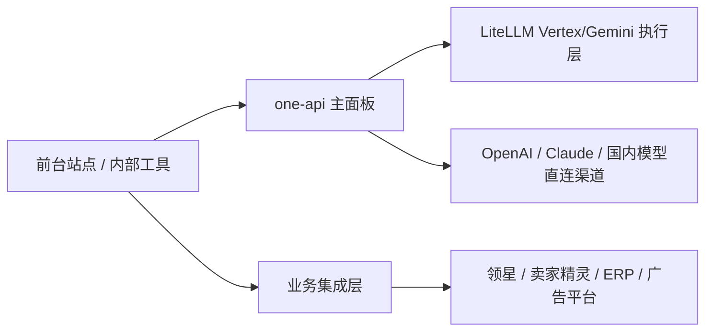

# 领星 / 卖家精灵 API 边界判断

## 结论
**不要把 `领星 / 卖家精灵` 这类业务 API 直接并进 AI Gateway 主系统。**

应该拆成：

```text
AI Gateway
  只负责模型、密钥、路由、额度、日志

Business Integration Hub
  负责领星、卖家精灵、ERP、电商平台、广告平台这类业务 API
```

## 为什么不要混在一起

| 原因 | 说明 |
| --- | --- |
| 认证体系完全不同 | AI 厂商是 key / project / service account，业务平台常常是 OAuth、店铺授权、用户授权、组织授权 |
| 节流规则不同 | AI 网关是 token / RPM / TPM；业务 API 更像报表、分页、同步任务、拉单、拉广告数据 |
| 数据结构完全不同 | AI 网关处理 prompt / completion / image；业务 API 处理订单、库存、ASIN、关键词、报表 |
| 故障模型不同 | AI 网关看 429、配额、模型异常；业务 API 看授权失效、分页断点、任务队列、平台限流 |
| 运维边界不同 | AI 网关偏在线转发；业务 API 更偏异步同步、任务状态、审计、重试队列 |

## 卖家精灵

| 项 | 结论 |
| --- | --- |
| 官方文档 | 有公开 API 文档站 |
| 适合并进 AI Gateway 吗 | 不适合 |
| 正确做法 | 放到独立业务集成层，后面再作为工具能力给 AI 用 |

## 领星

| 项 | 结论 |
| --- | --- |
| 这轮是否查到清晰统一的公开 OpenAPI 文档 | 没有查到像卖家精灵那样直白的统一公开文档入口 |
| 适合并进 AI Gateway 吗 | 更不适合 |
| 正确做法 | 先把它视为 ERP / 业务系统集成，不要和模型网关混成一个面板 |

## 真正推荐的结构



## 如果以后一定要让 AI 用这些业务数据
不要把它们塞进 AI Gateway 里，而是：
1. 业务集成层先把数据拉回来。
2. 再暴露成内部工具接口。
3. 最后让 AI 通过工具调用它们。

这样边界最清楚，也最不容易后面全盘返工。

## 来源
- https://open-doc.sellersprite.com/
- https://www.sellersprite.com/api
